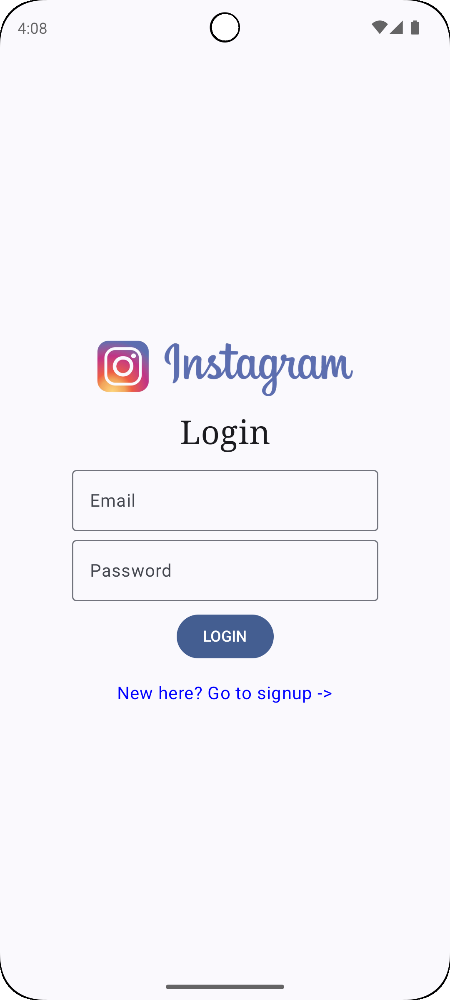
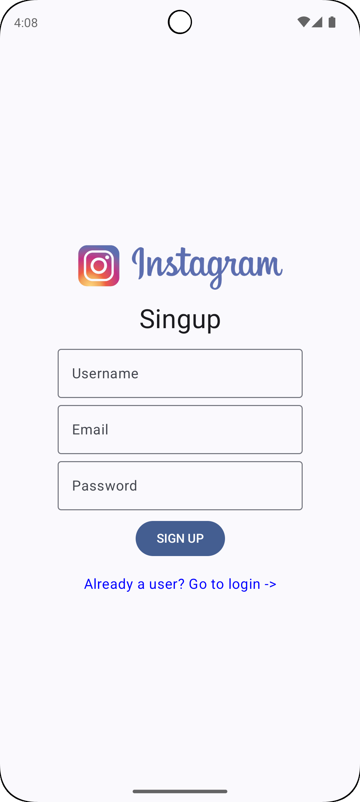
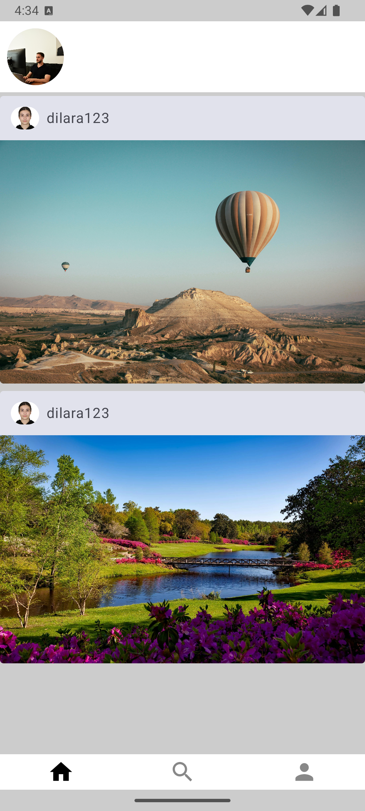
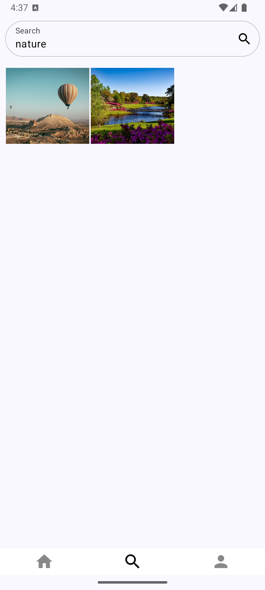
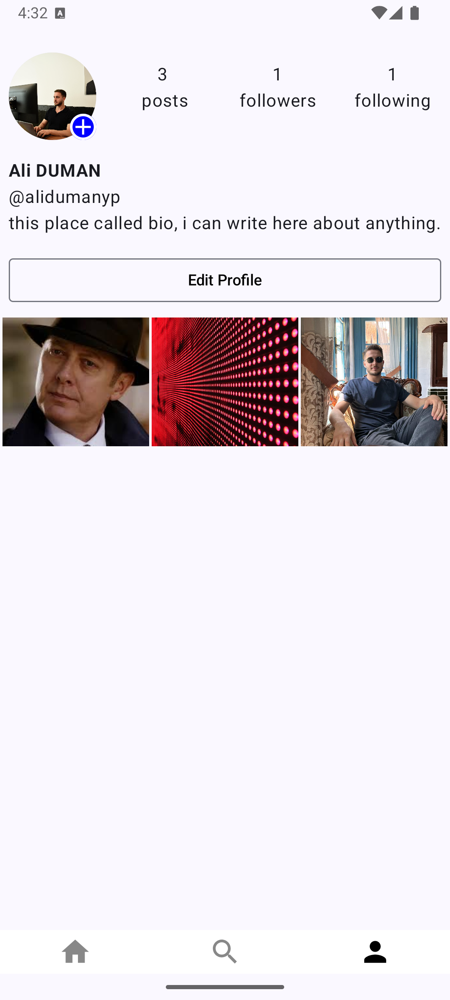
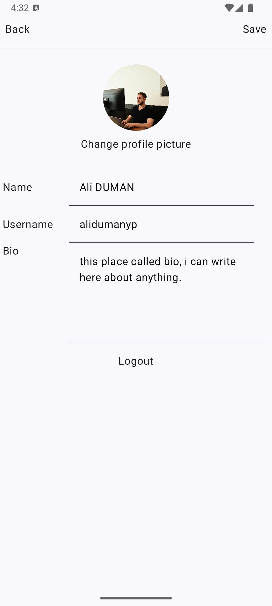
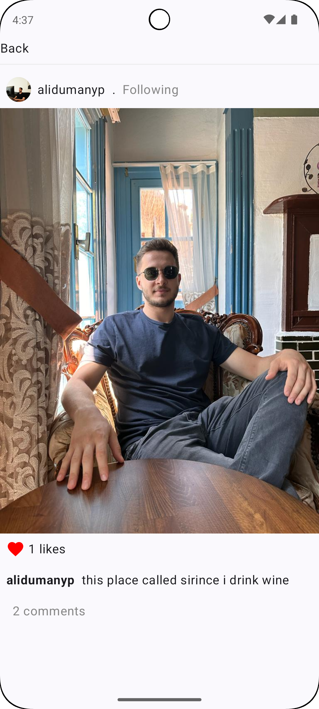

# InstagramCloneCompose

A modern Instagram clone application built using Jetpack Compose. The app includes user authentication, profile management, post creation, and more, offering an Instagram-like experience for exploring posts and interacting with other users.

## Features
- **User Authentication**: Secure login and signup using Firebase.
- **Profile Management**: View and edit user profiles.
- **Feed Screen**: Explore and interact with posts.
- **Post Creation**: Create and share new posts with other users.
- **Search Functionality**: Search for users and posts.
- **Single Post View**: Detailed view of individual posts with comments.

## Technologies Used
- **Jetpack Compose**: For building modern, declarative UI.
- **Kotlin**: Primary language for development.
- **Firebase**: Handles authentication, database, and storage.
- **MVVM Architecture**: Ensures maintainable and scalable code.
- **State Management**: Managed using ViewModel and LiveData/StateFlow.
- **Dependency Injection**: Using Hilt for managing dependencies.

## Project Structure
- **auth**: Handles authentication-related screens and logic (e.g., `LoginScreen.kt`, `ProfileScreen.kt`, `SignupScreen.kt`).
- **data**: Manages data models and events (`CommentData.kt`, `PostData.kt`, `UserData.kt`).
- **main**: Contains the core screens and features of the app such as the feed, comments, user posts, etc. (e.g., `FeedScreen.kt`, `MyPostScreen.kt`, `SearchScreen.kt`).
- **ui.theme**: Defines the app's theme and UI styles (`Color.kt`, `Theme.kt`, `Type.kt`).
- **HiltModule**: Manages dependency injection setup.
- **IgViewModel**: Central ViewModel for state and business logic management.
- **MainActivity**: Entry point of the application.

## Application Screenshots

| Login Screen | Signup Screen | Main Feed | Search Page |
| --- | --- | --- | --- |
|  |  |  |  |

| My Profile | Edit Profile | Single Post |
| --- | --- | --- |
|  |  |  |

## Installation and Setup

1. Clone the repository:
   ```bash
   git clone https://github.com/alidumanyp/InstagramCloneCompose.git
